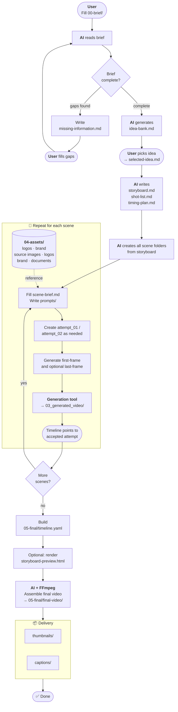

# AI Storyboard Video Template

A reusable template for creating AI-assisted storyboard videos.

This template helps you turn a video idea into:

1. A clear brief
2. Creative ideas
3. A storyboard
4. Scene-by-scene prompts
5. First-frame candidates and generated scene videos
6. A final assembled video
7. Thumbnails and captions

## Core Workflow



## Folder Meaning

| Folder           | Purpose                                                                     |
| ---------------- | --------------------------------------------------------------------------- |
| `00-brief/`      | Project brief, constraints, and references                                  |
| `01-ideas/`      | AI-generated ideas, selected idea, and missing information                  |
| `02-storyboard/` | Storyboard, shot list, and timing plan                                      |
| `03-scenes/`     | Scene folders, prompts, first/last frames, generated scene files            |
| `04-assets/`     | Source materials and reusable product reference images                      |
| `05-final/`      | Final combined video, thumbnails, and captions                              |
| `.agents/workflows/` | Workflow instructions referenced by `AGENTS.md`                         |
| `.agents/skills/`        | Local workflow skills for future automation                                 |
| `tools/`         | Setup notes and external tool installation guidance                         |

## Important Rule

`04-assets/` is for source files and reusable product references only.

Generated product reference angles can go in:

```txt
04-assets/references/
```

Scene outputs still belong in scene attempt folders.

Generated scene videos should go inside the relevant scene folder:

```txt
03-scenes/scene-001-example/attempt_01/03_generated_video/
```

First frames are required for each scene. Last frames have prompts by default, but are optional during video generation.

Do not create separate scene audio by default. If the selected video model supports audio, include audio direction in the video prompt. If the video generation tool returns usable audio inside the video, keep it with that generated video.

Final combined outputs should go into:

```txt
05-final/
```

## Scene Creation

Do not create scene folders manually from scratch. Use the storyboard automation script:

```bash
uv run python .agents/skills/create-scenes-from-storyboard/scripts/create_scenes_from_storyboard.py
```

## Attempt Rule

Use attempt folders as the revision and approval mechanism.

Examples:

```txt
attempt_01/01_first_frame/scene001_hook_first-frame_v001.png
attempt_01/02_last_frame/scene001_hook_last-frame_v001.png
attempt_01/03_generated_video/scene001_hook_video_v001.mp4
```

When the user asks for a revision, copy the latest attempt to the next attempt:

```bash
uv run python .agents/skills/create-next-attempt/scripts/create_next_attempt.py 03-scenes/scene-001-example
```

Ask the user which attempt is acceptable. The final timeline should point to the accepted attempt and chosen video.

## Storyboard HTML Preview

Render `05-final/timeline.yaml` into a browser-friendly storyboard preview:

```bash
uv run python .agents/skills/render-storyboard-html/scripts/render_storyboard_html.py \
  --timeline 05-final/timeline.yaml \
  --output 05-final/storyboard-preview.html
```

Then open `05-final/storyboard-preview.html`.

## Start With AI

Open this project in your AI coding tool and ask:

```txt
Read AGENTS.md and follow .agents/workflows/onboarding-interview-workflow.md to interview me for a new storyboard video project.
```

## Higgsfield

This template is tool-neutral, but Higgsfield is the first recommended generation tool.

See:

```txt
tools/install-higgsfield-skills.md
```
