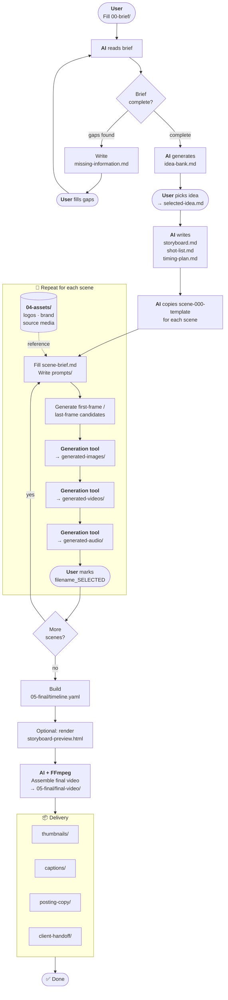

# AI Storyboard Video Template

A reusable template for creating AI-assisted storyboard videos.

This template helps you turn a video idea into:

1. A clear brief
2. Creative ideas
3. A storyboard
4. Scene-by-scene prompts
5. Generated scene images/videos/audio
6. A final assembled video
7. Thumbnails, captions, posting copy, and client handoff files

## Core Workflow



## Folder Meaning

| Folder           | Purpose                                                                     |
| ---------------- | --------------------------------------------------------------------------- |
| `00-brief/`      | Project brief, constraints, and references                                  |
| `01-ideas/`      | AI-generated ideas, selected idea, and missing information                  |
| `02-storyboard/` | Storyboard, shot list, and timing plan                                      |
| `03-scenes/`     | Scene folders, prompts, first/last frames, generated scene files            |
| `04-assets/`     | Source materials provided by the user/client                                |
| `05-final/`      | Final combined video, thumbnails, captions, posting copy, and handoff files |
| `skills/`        | Local workflow skills for future automation                                 |
| `tools/`         | Setup notes and external tool installation guidance                         |

## Important Rule

`04-assets/` is for source files only.

Generated scene files should go inside the relevant scene folder:

```txt
03-scenes/scene-001-example/generated-images/
03-scenes/scene-001-example/generated-videos/
03-scenes/scene-001-example/generated-audio/
```

Final combined outputs should go into:

```txt
05-final/
```

## Scene Creation

Do not create scene folders manually from scratch.

Copy:

```txt
03-scenes/scene-000-template/
```

Then rename it:

```txt
03-scenes/scene-001-hook-example/
03-scenes/scene-002-context-example/
03-scenes/scene-003-main-message-example/
```

Or use the helper script:

```bash
python skills/create-scene-from-template/scripts/create_scene.py --number 1 --name "hook-matcha-pour"
```

## Selection Rule

Use filename versioning.

Examples:

```txt
scene001_hook_image_v001.png
scene001_hook_image_v002.png
scene001_hook_image_SELECTED.png
```

When a file is selected for final use, include `_SELECTED` in the filename.

The final timeline should use `_SELECTED` files.

## Storyboard HTML Preview

Render `05-final/timeline.yaml` into a browser-friendly storyboard preview:

```bash
python skills/render-storyboard-html/scripts/render_storyboard_html.py \
  --timeline 05-final/timeline.yaml \
  --output 05-final/storyboard-preview.html
```

Then open `05-final/storyboard-preview.html`.

## Start With AI

Open this project in your AI coding tool and ask:

```txt
Read AGENTS.md and help me start a new storyboard video project.
```

## Higgsfield

This template is tool-neutral, but Higgsfield is the first recommended generation tool.

See:

```txt
tools/install-higgsfield-skills.md
```
